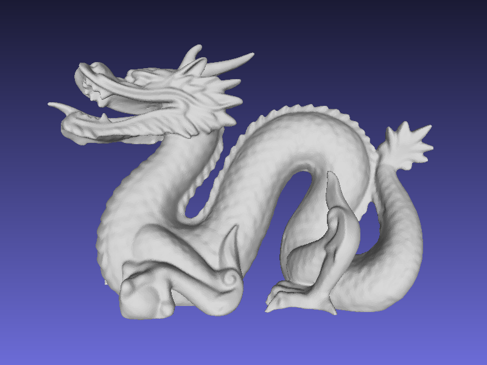
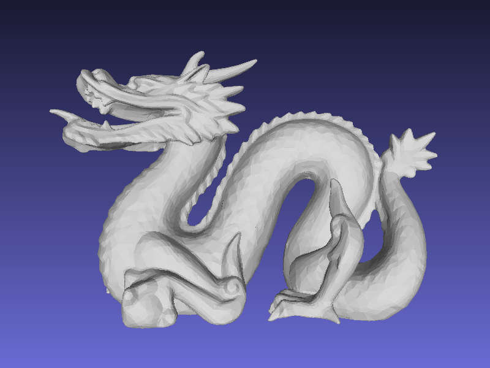
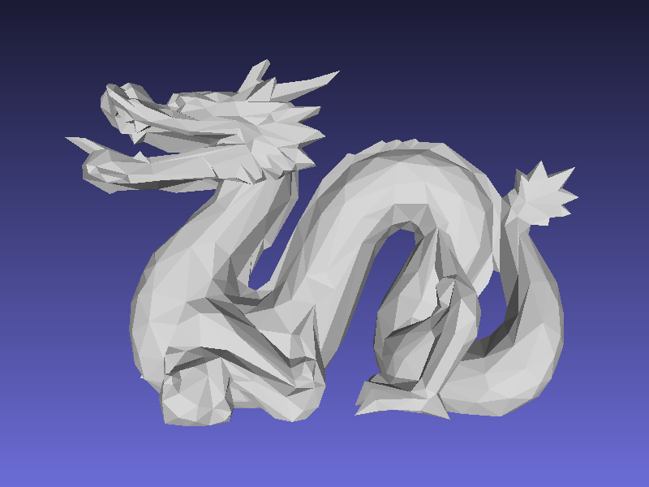
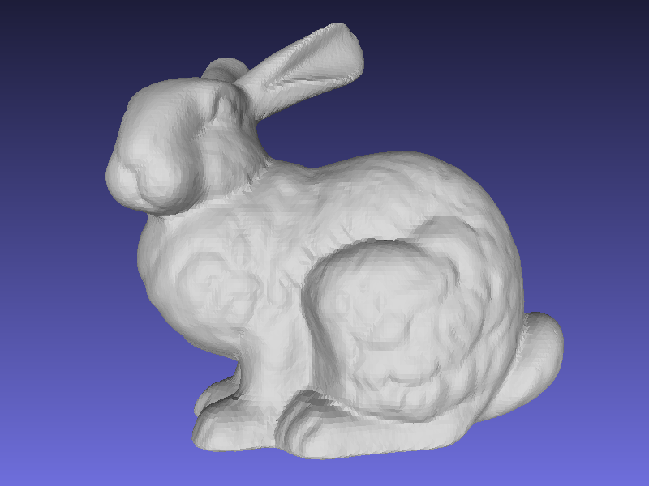
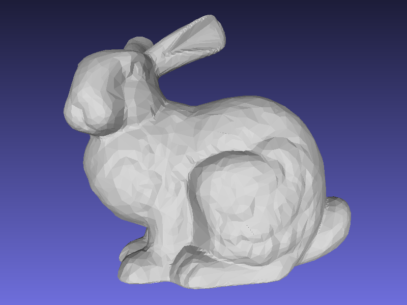
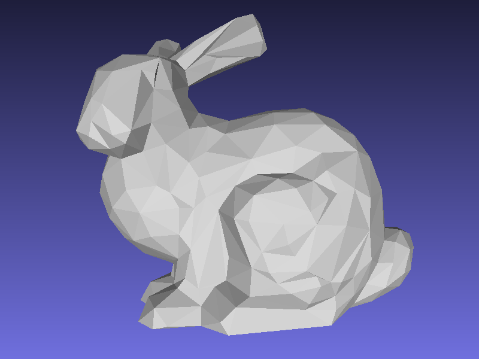
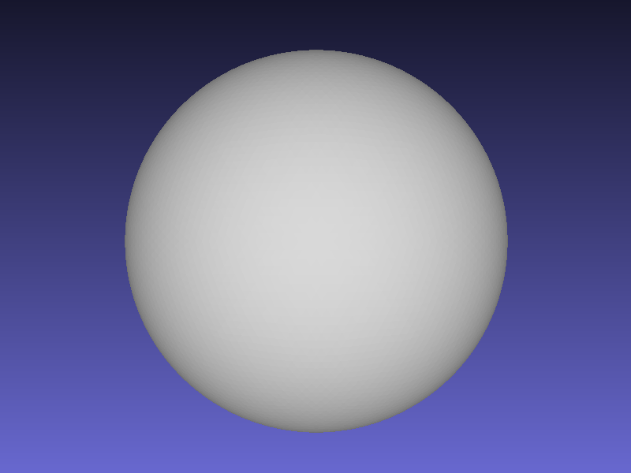
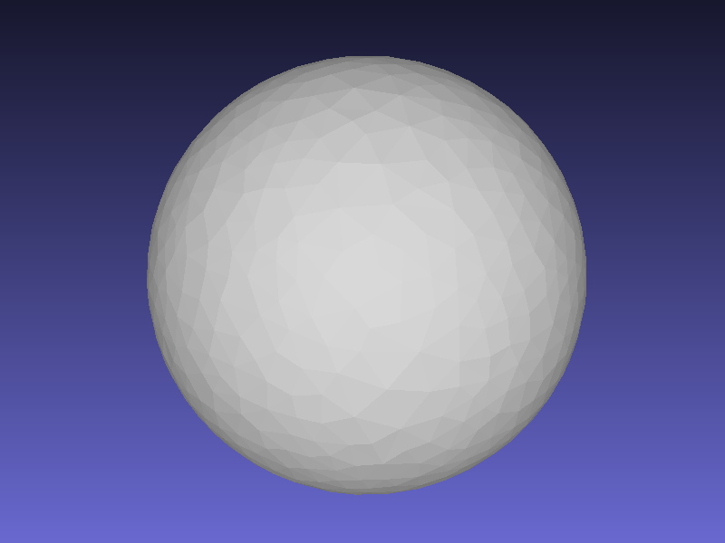
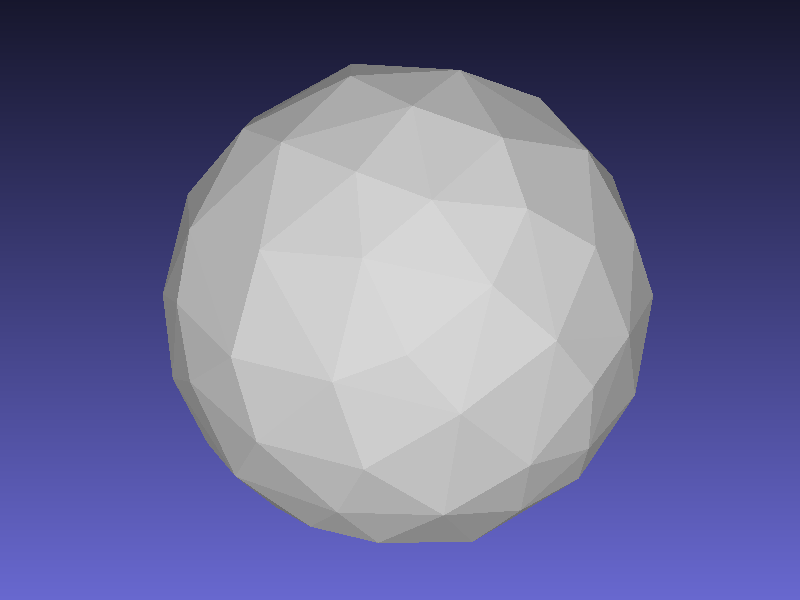

#网格简化
__徐磊 201301134__

###摘要
- 实现了网格简化的基本功能
- 使用最小堆进行了复杂度的优化
- 进行了一些常数级的优化
- [Link to GitHub](https://github.com/leopard1/Mesh-Simplify.git)

###问题描述
- 基本要求：对于一个输入的网格，根据给定的百分比进行简化。
- 扩展功能：简化加速、误差度量、拓扑保持等。

###算法设计
- 实验中使用标准的边坍塌算法，通过计算偏导数来获得收缩点。
- MeshLab对于面片的正反是非常敏感的，正面为白色，反面为黑色。因此算法中加入了大量关于面片方向的判断，最终保证输出的结果所有面片都是正面向外。

###一些tricky
- 通过调节坍塌边的阈值，可以提升效果，尤其是对于比较规则的模型（垂直的情况），效果显著。
- 在程序中对于收缩点偏离坍塌边过远的情况做了特殊处理，在这种情况下选择中点。

###效果
<table>
<tr>
<td></td>
<td></td>
<td></td>
</tr>
<tr>
<th>原图 dragon.a</th><th>简化0.1 dragon.b</th><th>简化0.01 dragon.c</th>
</tr>
</table>

<table>
<tr>
<td></td>
<td></td>
<td></td>
</tr>
<tr>
<th>原图 bunny.a</th><th>简化0.1 bunny.b</th><th>简化0.01 bunny.c</th>
</tr>
</table>

<table>
<tr>
<td></td>
<td></td>
<td></td>
</tr>
<tr>
<th>原图 sphere.a</th><th>简化0.1 sphere.b</th><th>简化0.01 sphere.c</th>
</tr>
</table>

###总结和感受
网格简化总体了来说还是比较简单，在实现上没有遇到很多的问题。期初用python实现，由于效率问题迁移到了C，选择适当的编程语言和库是非常必要的。

